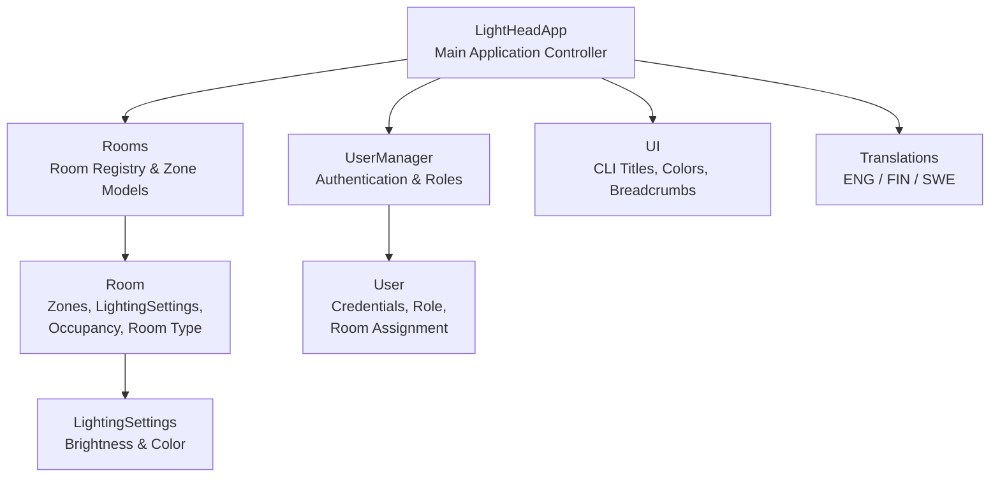

# LightHead3000Smart+ - Hotel Room Lightning Control System

## Demo documentation

## 1. Vision and Need

**LightHead3000Smart+** is a hotel room lighting control system designed to improve guest comfort, reduce energy consumption, and support hotel staff in managing room environments efficiently.

The system simulates a real hotel lighting controller with:

- A simple, intuitive interface for guests
- A centralized control panel for staff
- Automatic energy‑saving behavior
- Multi‑language support
- Pre‑installed lighting presets for different moods

The goal is to demonstrate a complete software product lifecycle: from requirements to architecture, implementation, and testing.

## 2. Requirements

### 2.1 Functional Requirements

The key functional requirements implemented in the system.

| REQ-ID | Requirement Description |
| --- | ---- |
| **002** | The guest is able to choose the operating system language (ENG/FIN/SWE) |
| **003** | The system is energy‑efficient: lights stay off when the room is empty |
| **004** | The control device clearly indicates the status of every light in the room |
| **005** | Every room can be controlled centrally by hotel personnel |
| **007** | The system must be easy to install and scalable |
| **009** | Brightness, color, and color temperature can be adjusted |
| **012** | The control device displays possible zones (bathroom, bedroom, etc.) separately |
| **013** | The system has pre-installed lightning setups for different moods and situations |

### 2.2 Non-functional and/or Demo Requirements

- CLI‑based prototype for demo purposes
- Clear UI feedback (colors, breadcrumbs, titles)
- Maintainable modular code (Rooms, Users, UI, Translations, App logic)
- Extensible room model (supports suites with custom zones)

### 2.3 Requirements Not Implemented in This Demo

The original LightHead3000Smart+ specification includes several requirements that fall outside the scope of this CLI‑based demonstration. These features typically require hardware integration, sensors, mobile applications, or real‑time data processing that cannot be meaningfully simulated in a terminal environment.

The following requirements were not implemented in this demo:

| REQ‑ID | Requirement Description | Reason Not Implemented in Demo |
| --- | --- | --- |
| **001** | System works reliably as intended (all requirements met) | Full compliance requires hardware, sensors, and long‑term reliability testing beyond demo scope |
| **006** | Room lights can indicate an emergency | Requires integration with hotel emergency systems and dedicated light patterns |
| **008** | Wall bracket has wireless charging | Hardware feature; not representable in software demo |
| **010** | Control device can be removed from wall mount | Hardware requirement; not applicable to CLI prototype |
| **011** | Doorway IR sensors detect room occupancy | Requires physical IR sensors and real‑time monitoring logic |
| **014** | Guest can control lights via mobile app before arrival | Requires mobile app + backend server + authentication flow |
| **015** | Control device displays a map of the hotel room | Requires graphical UI or touchscreen interface |
| **016** | Staff can define preferred lighting setup via their own app | Requires separate staff mobile app + backend |
| **017** | Lights adjust automatically based on time of day / natural light | Requires light sensors, time‑based automation, and environmental data |
| **018** | Hotel manager can monitor electricity consumption | Requires energy metering hardware and analytics dashboard |

One of the most important promises of the LightHead3000Smart+ system is exceptional ease of use. The real product is designed so that:

- Guests with no technical background can operate the lighting system effortlessly
- The touchscreen UI is intuitive, visual, and self‑explanatory
- The interface supports quick, glanceable status indicators
- The system minimizes cognitive load and avoids complex menus

However, this demo is implemented as a CLI, which does not fully represent the intended user experience. This limitation is intentional and aligns with the project scope as the goal is to demonstrate architecture and functionality, not to build a production‑ready touchscreen interface.

## 3. Architecture & Software Design

### 3.1 High-Level Architecture

### 3.2 Components

#### LightHeadApp

- Main controller
- Handles menus, navigation, and user flow
- Connects user actions to room logic

#### Rooms & Room

- Stores all room objects
- Each room contains:
  - Zones (main, bedroom, bathroom, or custom suite zones)
  - Lighting settings (brightness + color)
  - Occupancy state
  - Room type (basic/suite)

#### UserManager & User

- Authentication
- Role‑based access (visitor vs staff)
- Visitors are linked to specific rooms

#### UI

- Provides consistent CLI formatting
- Color‑coded menus for clarity

#### Translations

- Provides multilingual support
- All UI strings routed through translation layer

### 3.3 Design Decisions

| What | Why? |
| --- | ---|
| Dataclasses used for Room, LightingSettings, User | Clean and maintainable |
| Zone‑based lighting |  |
| Role‑based menus | Different capabilities for visitors and staff |
| Breadcrumb navigation | Improves usability in CLI |
| Scalable room initialization | Adding new rooms is trivial |

## 4. Testing

# Test Plan — LightHead Hotel Lighting System

### 4.1 Introduction

This document describes the test plan for the LightHead Hotel Lighting System.
The system allows hotel guests and staff to control room lighting through a
command-line interface. The tests cover the core logic of the application
including room and lighting management, user authentication, multilingual
support, and integrated application flows.

---

### 4.2 Scope

#### In scope
- Room and lighting settings logic (`rooms.py`)
- User management and authentication (`userhandler.py`)
- Multilingual translation system (`translations.py`)
- Core application flows (`lightHeadApp.py`)

#### Out of scope
- UI rendering and terminal output (`ui.py`)
- Manual end-to-end testing through the interactive menu
- Performance and load testing

---

### 4.3 Test Objectives

- Verify that rooms are created correctly with the right defaults and zone configurations
- Verify that brightness and color can be set and retrieved per zone independently
- Verify that occupancy toggling correctly updates room state and lighting
- Verify that user authentication accepts valid credentials and rejects invalid ones
- Verify that all three languages return correct translations for all keys
- Verify that the application initializes with the expected rooms, users, and language
- Verify that lighting presets and staff maintenance flows work as expected

---

### 4.4 Test Environment

| Property | Value |
|---|---|
| Language | Python 3.13 |
| Test framework | pytest |
| Operating system | Windows |
| Execution command | `python -m pytest tests/ -v` |

---

### 4.5 Test Structure

Tests are organized into four files, each corresponding to a source file.

| Test file | Source file |
|---|---|
| `tests/test_rooms.py` | `src/rooms.py` |
| `tests/test_userhandler.py` | `src/userhandler.py` |
| `tests/test_translations.py` | `src/translations.py` |
| `tests/test_lightHeadApp.py` | `src/lightHeadApp.py` |

---

### 4.6 Test Cases

#### 4.6.1 LightingSettings

| ID | Test | Expected result |
|---|---|---|
| LS-01 | Default brightness | Brightness initializes to 0 |
| LS-02 | Default color | Color initializes to "white" |
| LS-03 | Custom values | Custom brightness and color are stored correctly |

#### 4.6.2 Room — Default Construction

| ID | Test | Expected result |
|---|---|---|
| RD-01 | Default zones exist | Room has main, bedroom and bathroom zones |
| RD-02 | Default occupancy | Occupancy is False |
| RD-03 | Default availability | Available is False |
| RD-04 | Default room type | Room type is "basic" |
| RD-05 | Room ID stored | Room stores the given ID correctly |

#### 4.6.3 Room — from_zone_names

| ID | Test | Expected result |
|---|---|---|
| RZ-01 | Custom zones created | Only the given zones are created |
| RZ-02 | Available after creation | Room is marked as available |
| RZ-03 | Suite type for suite ID | Room type is "suite" for IDs in SUITES |
| RZ-04 | Basic type for non-suite ID | Room type is "basic" for IDs not in SUITES |
| RZ-05 | Default lighting in zones | All zones start with brightness 0 |

#### 4.6.4 Room — Brightness

| ID | Test | Expected result |
|---|---|---|
| RB-01 | Default brightness | Brightness is 0 before any changes |
| RB-02 | Set and get brightness | Brightness updates correctly |
| RB-03 | Set brightness to zero | Brightness can be set back to 0 |
| RB-04 | Set brightness to max | Brightness accepts 100 |
| RB-05 | Brightness isolated per zone | Changing one zone does not affect others |

#### 4.6.5 Room — Color

| ID | Test | Expected result |
|---|---|---|
| RC-01 | Default color | Color is "white" before any changes |
| RC-02 | Set color by index | Index maps to correct color in COLORS |
| RC-03 | All valid indices | Every COLORS index sets and retrieves correctly |
| RC-04 | Set color all zones | All zones updated to the same color |
| RC-05 | Color isolated per zone | Changing one zone does not affect others |

#### 4.6.6 Room — Occupancy

| ID | Test | Expected result |
|---|---|---|
| RO-01 | Default occupancy | Occupancy is False on a new room |
| RO-02 | Set occupancy true | Occupancy reflects True after being set |

#### 4.6.7 Room — Lights Switching

| ID | Test | Expected result |
|---|---|---|
| RL-01 | Lights off | All zones set to brightness 0 and color White |
| RL-02 | Lights on | All zones set to brightness 100 and color White |
| RL-03 | Lights off after on | Brightness resets to 0 after turning off |
| RL-04 | Get sections | Returns all zone names |

#### 4.6.8 Rooms Collection

| ID | Test | Expected result |
|---|---|---|
| RC-01 | Add and get room | Room retrievable by ID after adding |
| RC-02 | Get second room | Multiple rooms independently retrievable |
| RC-03 | Iterate over rooms | All rooms returned when iterating |
| RC-04 | Sorted room items | room_items returns rooms sorted by ID |
| RC-05 | Overwrite same ID | Adding a room with existing ID replaces the old one |

#### 4.6.9 User

| ID | Test | Expected result |
|---|---|---|
| US-01 | Visitor fields | All fields stored correctly |
| US-02 | Staff user no room | room_id and room_type are None |
| US-03 | Suite visitor | Suite room type and room ID stored correctly |

#### 4.6.10 UserManager — Authentication

| ID | Test | Expected result |
|---|---|---|
| UA-01 | Valid visitor login | Returns visitor User object |
| UA-02 | Valid staff login | Returns staff User object |
| UA-03 | Wrong password | Returns None |
| UA-04 | Unknown user | Returns None |
| UA-05 | Empty credentials | Returns None |
| UA-06 | Overwrite user | New user replaces old one under same username |
| UA-07 | Old password after overwrite | Old password no longer authenticates |

#### 4.6.11 Translations — English

| ID | Test | Expected result |
|---|---|---|
| TE-01 | Welcome message | Returns correct English string |
| TE-02 | Login label | Returns correct English string |
| TE-03 | Zone names | Returns plain English zone names |
| TE-04 | On/off strings | Returns "on" and "off" |
| TE-05 | Brightness limits | Messages contain "min" and "max" |

#### 4.6.12 Translations — Finnish

| ID | Test | Expected result |
|---|---|---|
| TF-01 | Welcome message | Returns correct Finnish string |
| TF-02 | Login label | Returns correct Finnish string |
| TF-03 | Zone names | Returns correct Finnish translations |
| TF-04 | On/off strings | Returns "päälle" and "pois" |

#### 4.6.13 Translations — Swedish

| ID | Test | Expected result |
|---|---|---|
| TS-01 | Welcome message | Returns correct Swedish string |
| TS-02 | Login label | Returns correct Swedish string |
| TS-03 | Zone names | Returns correct Swedish translations |
| TS-04 | On/off strings | Returns "på" and "av" |

#### 4.6.14 Translations — Fallback

| ID | Test | Expected result |
|---|---|---|
| TB-01 | Missing key | Returns the key itself |
| TB-02 | Unknown language | Returns the key itself |
| TB-03 | Key parity | All three languages have identical keys |

#### 4.6.15 App Initialization

| ID | Test | Expected result |
|---|---|---|
| AI-01 | Default language | App starts with English |
| AI-02 | Rooms initialized | All default rooms present on startup |
| AI-03 | Suite 301 zones | Room 301 has main, sauna and balcony zones |
| AI-04 | Users initialized | Default visitor and staff authenticate successfully |
| AI-05 | Invalid user | Non-existent user is not authenticated |

#### 4.6.16 Occupancy Toggle

| ID | Test | Expected result |
|---|---|---|
| OT-01 | Enter room sets occupancy | Room marked as occupied |
| OT-02 | Enter room sets brightness | Main zone brightness set to 50 |
| OT-03 | Exit room clears occupancy | Room marked as unoccupied |
| OT-04 | Exit room turns off lights | All zones set to brightness 0 |

#### 4.6.17 Lighting Presets

| ID | Test | Expected result |
|---|---|---|
| LP-01 | Preset 1 Relaxing | All zones set to Relaxing color |
| LP-02 | Preset 2 Bright energetic | All zones set to Bright energetic color |
| LP-03 | Preset 3 Movie mode | All zones set to Movie mode color |
| LP-04 | Preset 4 Wild disco | All zones set to Wild disco caveman color |

#### 4.6.18 Staff Access

| ID | Test | Expected result |
|---|---|---|
| SA-01 | Staff authentication | Staff credentials return staff role user |
| SA-02 | Access unoccupied room | Unoccupied room accessible to staff |
| SA-03 | See occupied room | Occupied room visible as occupied |
| SA-04 | Maintenance lights on | All zones set to full brightness |
| SA-05 | Maintenance lights reset | All zones turned off |

#### 4.6.19 Language Switching

| ID | Test | Expected result |
|---|---|---|
| LS-01 | Switch to Finnish | App language updates to FIN |
| LS-02 | Switch to Swedish | App language updates to SWE |
| LS-03 | Switch back to English | App language restores to ENG |

### 4.7 Developer User Testing

In addition to automated tests, the developers performed manual user testing
by running the application in the terminal and going through all available
functionalities.

**When:** 18.-20.4.2026

**Who:** The development team

**How:** The application was launched manually in the terminal and all
features were tested by navigating through the menus as both a visitor
and a staff member.

#### What was tested

| Area | Actions performed |
|---|---|
| Authentication | Logging in as visitor and staff with correct and incorrect credentials |
| Room entry/exit | Entering and exiting rooms, verifying occupancy state and light behavior |
| Light control | Adjusting brightness and color per zone |
| Lighting presets | Applying all four presets and verifying color changes across zones |
| Language switching | Switching between English, Finnish and Swedish and verifying UI updates |
| Staff controls | Accessing rooms, turning maintenance lights on and off |

#### Results

No errors or unexpected behavior were found during manual testing.
All features worked as intended.

#### Observations and decisions

During testing the team discussed whether the light prereset on room exit
should also reset brightness to a specific default level. It was decided
that this feature will not be implemented at this stage, but it has been
noted as a potential improvement for future development.

### 4.8 Pass and Fail Criteria

**Pass:** All tests collected by pytest complete with status PASSED and no errors are reported.

**Fail:** Any test returns FAILED or ERROR. Failures must be investigated, the defect fixed in the source code, and the tests re-run before the build is considered stable.

## 5. What we learned

We learned that software development is not just writing code, but also:
- understanding what we are building and why (what problem we are solving)
- communicating with the team and stakeholders
- documenting my work
- planning the structure and architecture
- working according to the plan and modify it as necessary

We learned concretely to:
- identify stakeholders and create a stakeholder map
- write requirements wih a right level of detail (yes, we did it too abstract first)
- prioritize the requirements
- make a domain model (it was already partly familiar, but it's worth repeating)
- make a prototype

And also we learned that we have a great team with wonderful and skilled people!
