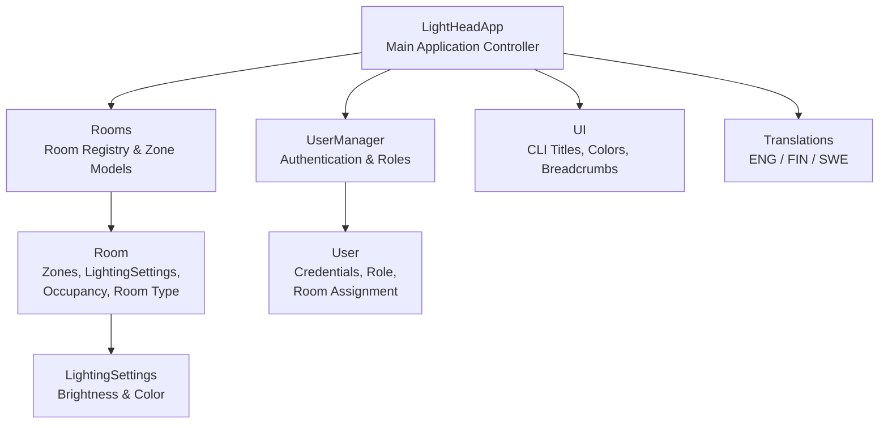

# LightHead3000Smart+ - Hotel Room Lightning Control System

## Demo documentation

## 1. Vision and Need

**LightHead3000Smart+** is a hotel room lighting control system designed to improve guest comfort, reduce energy consumption, and support hotel staff in managing room environments efficiently.

The system simulates a real hotel lighting controller with:

- A simple, intuitive interface for guests
- A centralized control panel for staff
- Automatic energy‑saving behavior
- Multi‑language support
- Pre‑installed lighting presets for different moods

The goal is to demonstrate a complete software product lifecycle: from requirements to architecture, implementation, and testing.

## 2. Requirements

### 2.1 Functional Requirements

The key functional requirements implemented in the system.

| REQ-ID | Requirement Description |
| --- | ---- |
| **002** | The guest is able to choose the operating system language (ENG/FIN/SWE) |
| **003** | The system is energy‑efficient: lights stay off when the room is empty |
| **004** | The control device clearly indicates the status of every light in the room |
| **005** | Every room can be controlled centrally by hotel personnel |
| **007** | The system must be easy to install and scalable |
| **009** | Brightness, color, and color temperature can be adjusted |
| **012** | The control device displays possible zones (bathroom, bedroom, etc.) separately |
| **013** | The system has pre-installed lightning setups for different moods and situations |

### 2.2 Non-functional and/or Demo Requirements

- CLI‑based prototype for demo purposes
- Clear UI feedback (colors, breadcrumbs, titles)
- Maintainable modular code (Rooms, Users, UI, Translations, App logic)
- Extensible room model (supports suites with custom zones)

### 2.3 Requirements Not Implemented in This Demo

The original LightHead3000Smart+ specification includes several requirements that fall outside the scope of this CLI‑based demonstration. These features typically require hardware integration, sensors, mobile applications, or real‑time data processing that cannot be meaningfully simulated in a terminal environment.

The following requirements were not implemented in this demo:

| REQ‑ID | Requirement Description | Reason Not Implemented in Demo |
| --- | --- | --- |
| **001** | System works reliably as intended (all requirements met) | Full compliance requires hardware, sensors, and long‑term reliability testing beyond demo scope |
| **006** | Room lights can indicate an emergency | Requires integration with hotel emergency systems and dedicated light patterns |
| **008** | Wall bracket has wireless charging | Hardware feature; not representable in software demo |
| **010** | Control device can be removed from wall mount | Hardware requirement; not applicable to CLI prototype |
| **011** | Doorway IR sensors detect room occupancy | Requires physical IR sensors and real‑time monitoring logic |
| **014** | Guest can control lights via mobile app before arrival | Requires mobile app + backend server + authentication flow |
| **015** | Control device displays a map of the hotel room | Requires graphical UI or touchscreen interface |
| **016** | Staff can define preferred lighting setup via their own app | Requires separate staff mobile app + backend |
| **017** | Lights adjust automatically based on time of day / natural light | Requires light sensors, time‑based automation, and environmental data |
| **018** | Hotel manager can monitor electricity consumption | Requires energy metering hardware and analytics dashboard |

One of the most important promises of the LightHead3000Smart+ system is exceptional ease of use. The real product is designed so that:

- Guests with no technical background can operate the lighting system effortlessly
- The touchscreen UI is intuitive, visual, and self‑explanatory
- The interface supports quick, glanceable status indicators
- The system minimizes cognitive load and avoids complex menus

However, this demo is implemented as a CLI, which does not fully represent the intended user experience. This limitation is intentional and aligns with the project scope as the goal is to demonstrate architecture and functionality, not to build a production‑ready touchscreen interface.

## 3. Architecture & Software Design

### 3.1 High-Level Architecture

### 3.2 Components

#### LightHeadApp

- Main controller
- Handles menus, navigation, and user flow
- Connects user actions to room logic

#### Rooms & Room

- Stores all room objects
- Each room contains:
  - Zones (main, bedroom, bathroom, or custom suite zones)
  - Lighting settings (brightness + color)
  - Occupancy state
  - Room type (basic/suite)

#### UserManager & User

- Authentication
- Role‑based access (visitor vs staff)
- Visitors are linked to specific rooms

#### UI

- Provides consistent CLI formatting
- Color‑coded menus for clarity

#### Translations

- Provides multilingual support
- All UI strings routed through translation layer

### 3.3 Design Decisions

| What | Why? |
| --- | ---|
| Dataclasses used for Room, LightingSettings, User | Clean and maintainable |
| Zone‑based lighting |  |
| Role‑based menus | Different capabilities for visitors and staff |
| Breadcrumb navigation | Improves usability in CLI |
| Scalable room initialization | Adding new rooms is trivial |

## 4. Testing

To be implemented

## 5. What we learned

???
